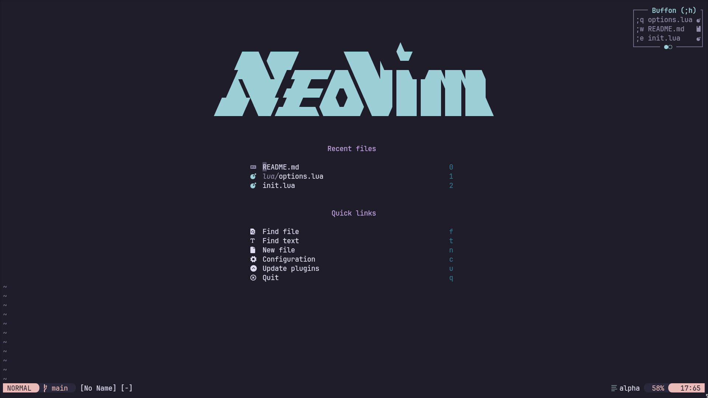
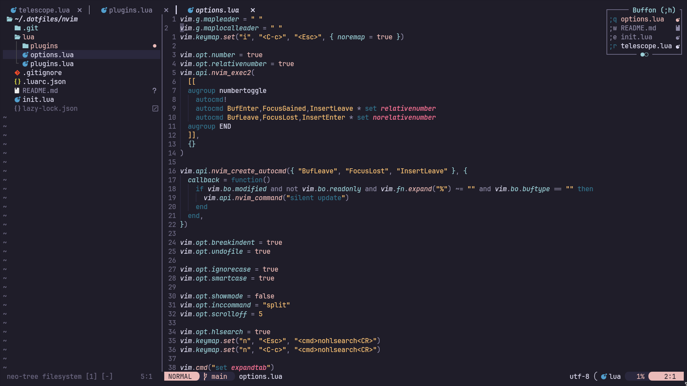
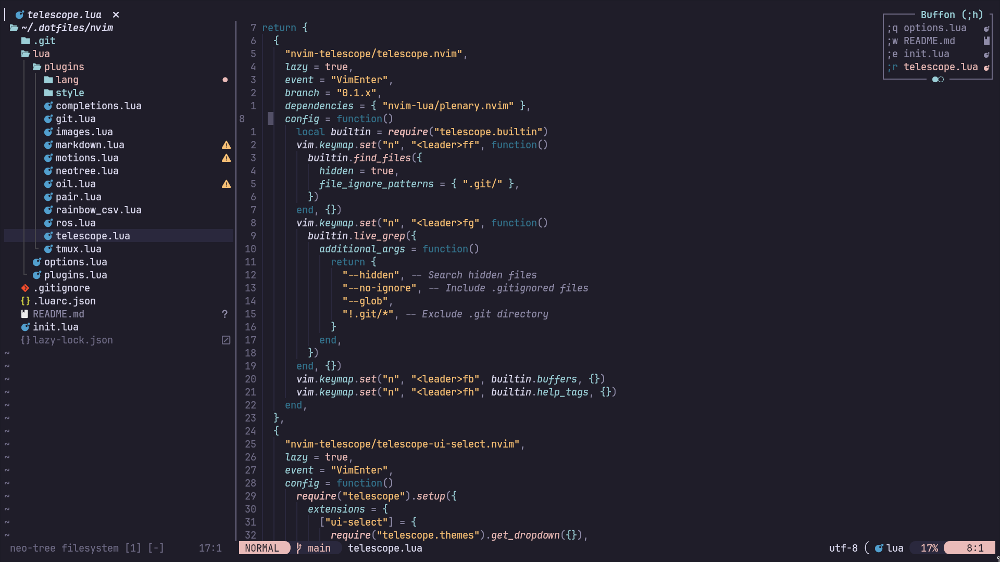
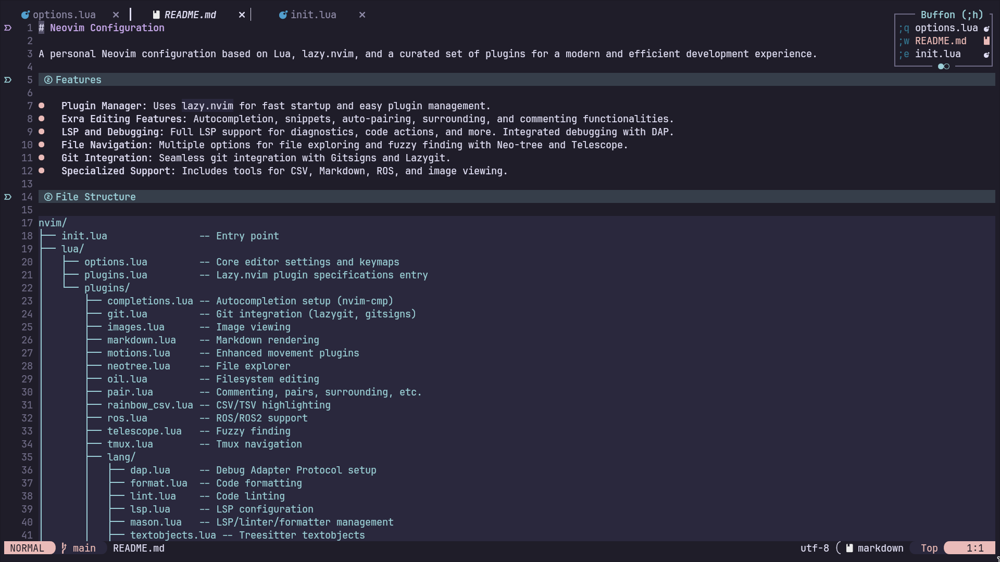

# Neovim Configuration

A personal Neovim configuration based on Lua, lazy.nvim, and a curated set of plugins for a modern and efficient development experience.

## Screenshots
<table>
  <tr>
    <td align="center"></td>
    <td align="center"></td>
  </tr>
  <tr>
    <td align="center"></td>
    <td align="center"></td>
  </tr>
</table>

## Table of Contents
- [Features](#features)
- [File Structure](#file-structure)
- [Installation](#installation)
  - [Prerequisites](#prerequisites)
  - [Setup](#setup)
- [Plugins](#plugins)
  - [Core](#core)
  - [Appearance & UI](#appearance--ui)
  - [Editing & Motions](#editing--motions)
  - [File Management](#file-management)
  - [Completions & LSP](#completions--lsp)
  - [Linting & Formatting](#linting--formatting)
  - [Treesitter & Language](#treesitter--language)
  - [Git](#git)
  - [Debugging](#debugging)
  - [Tools](#tools)
  - [Domain-Specific](#domain-specific)
- [Keymaps](#keymaps)
  - [General](#general)
  - [Telescope](#telescope)
  - [LSP](#lsp)
  - [Debugging (DAP)](#debugging-dap)
  - [ROS](#ros)

## Features

*   **Plugin Manager**: Uses `lazy.nvim` for fast startup and easy plugin management.
*   **Exra Editing Features**: Autocompletion, snippets, auto-pairing, surrounding, and commenting functionalities.
*   **LSP and Debugging**: Full LSP support for diagnostics, code actions, and more. Integrated debugging with DAP.
*   **File Navigation**: Multiple options for file exploring and fuzzy finding with Neo-tree and Telescope.
*   **Git Integration**: Seamless git integration with Gitsigns and Lazygit.
*   **Specialized Support**: Includes tools for CSV, Markdown, ROS, and image viewing.

## File Structure

```
nvim/
├── init.lua                -- Entry point
├── lua/
│   ├── options.lua         -- Core editor settings and keymaps
│   ├── plugins.lua         -- Lazy.nvim plugin specifications entry
│   └── plugins/
│       ├── completions.lua -- Autocompletion setup (nvim-cmp)
│       ├── git.lua         -- Git integration (lazygit, gitsigns)
│       ├── images.lua      -- Image viewing
│       ├── markdown.lua    -- Markdown rendering
│       ├── motions.lua     -- Enhanced movement plugins
│       ├── neotree.lua     -- File explorer
│       ├── oil.lua         -- Filesystem editing
│       ├── pair.lua        -- Commenting, pairs, surrounding, etc.
│       ├── rainbow_csv.lua -- CSV/TSV highlighting
│       ├── ros.lua         -- ROS/ROS2 support
│       ├── telescope.lua   -- Fuzzy finding
│       ├── tmux.lua        -- Tmux navigation
│       ├── lang/
│       │   ├── dap.lua     -- Debug Adapter Protocol setup
│       │   ├── format.lua  -- Code formatting
│       │   ├── lint.lua    -- Code linting
│       │   ├── lsp.lua     -- LSP configuration
│       │   ├── mason.lua   -- LSP/linter/formatter management
│       │   ├── textobjects.lua -- Treesitter textobjects
│       │   └── treesitter.lua  -- Treesitter configuration
│       └── style/
│           ├── alpha.lua       -- Dashboard
│           ├── bufferline.lua  -- Buffer tabs
│           ├── indent.lua      -- Indentation guides
│           ├── lualine.lua     -- Status line
│           ├── noice.lua       -- Command line UI
│           └── theme.lua       -- Colorscheme (rose-pine)
└── .luarc.json             -- Lua language server config
```

## Installation

### Prerequisites

Before you begin, ensure you have the following external dependencies installed:

*   [**Neovim**](https://github.com/neovim/neovim/wiki/Installing-Neovim) (v0.9.0 or newer)
*   [**Git**](https://git-scm.com/book/en/v2/Getting-Started-Installing-Git)
*   [**lazygit**](https://github.com/jesseduffield/lazygit#installation) (for the git UI)
*   [**ripgrep**](https://github.com/BurntSushi/ripgrep#installation) (for Telescope live grep)
*   [**A Nerd Font**](https://www.nerdfonts.com/font-downloads) (for icons)
*   [**ImageMagick**](https://imagemagick.org/script/download.php) (to view images)
*   A C compiler (e.g., `gcc`, `clang`) for `nvim-treesitter`.


### Setup

1.  Clone this repository to your Neovim configuration directory (e.g., `~/.config/nvim`):
    ```bash
    git clone https://github.com/mathewp88/nvim.git ~/.config/nvim
    ```
2.  Start Neovim. `lazy.nvim` will automatically install the plugins.

## Plugins

### Core

| Plugin                                     | Description                               |
| ------------------------------------------ | ----------------------------------------- |
| [folke/lazy.nvim](https://github.com/folke/lazy.nvim) | A modern plugin manager for Neovim    |

### Appearance & UI

| Plugin                                     | Description                               |
| ------------------------------------------ | ----------------------------------------- |
| [goolord/alpha-nvim](https://github.com/goolord/alpha-nvim) | A fast and fully programmable startup screen |
| [akinsho/bufferline.nvim](https://github.com/akinsho/bufferline.nvim) | A snazzy buffer line for Neovim       |
| [lukas-reineke/indent-blankline.nvim](https://github.com/lukas-reineke/indent-blankline.nvim) | Indentation guides                        |
| [nvim-lualine/lualine.nvim](https://github.com/nvim-lualine/lualine.nvim) | A blazing fast and easy to configure statusline |
| [folke/noice.nvim](https://github.com/folke/noice.nvim) | Highly experimental UI for messages and cmdline |
| [rose-pine/neovim](https://github.com/rose-pine/neovim) | A soothing colorscheme                |
| [nvim-tree/nvim-web-devicons](https://github.com/nvim-tree/nvim-web-devicons) | Icons for Neovim                      |

### Editing & Motions

| Plugin                                     | Description                               |
| ------------------------------------------ | ----------------------------------------- |
| [numToStr/Comment.nvim](https://github.com/numToStr/Comment.nvim) | Smart and powerful commenting         |
| [windwp/nvim-autopairs](https://github.com/windwp/nvim-autopairs) | Autopairs for '(' '[' '{'             |
| [kylechui/nvim-surround](https://github.com/kylechui/nvim-surround) | Add/change/delete surroundings in pairs |
| [windwp/nvim-ts-autotag](https://github.com/windwp/nvim-ts-autotag) | Use treesitter to autoclose and rename HTML tags |
| [mbbill/undotree](https://github.com/mbbill/undotree) | The ultimate undo history visualizer  |
| [folke/flash.nvim](https://github.com/folke/flash.nvim) | Navigate your code with search labels |
| [oskarrrrrrr/symbols.nvim](https://github.com/oskarrrrrrr/symbols.nvim) | A symbols browser                     |
| [francescarpi/buffon.nvim](https://github.com/francescarpi/buffon.nvim) | A buffer sorter                     |

### File Management

| Plugin                                     | Description                               |
| ------------------------------------------ | ----------------------------------------- |
| [nvim-neo-tree/neo-tree.nvim](https://github.com/nvim-neo-tree/neo-tree.nvim) | A file explorer for Neovim            |
| [stevearc/oil.nvim](https://github.com/stevearc/oil.nvim) | Edit the filesystem like a Neovim buffer |

### Completions & LSP

| Plugin                                     | Description                               |
| ------------------------------------------ | ----------------------------------------- |
| [hrsh7th/nvim-cmp](https://github.com/hrsh7th/nvim-cmp) | A completion engine plugin for Neovim |
| [hrsh7th/cmp-nvim-lsp](https://github.com/hrsh7th/cmp-nvim-lsp) | nvim-cmp source for neovim's built-in LSP |
| [L3MON4D3/LuaSnip](https://github.com/L3MON4D3/LuaSnip) | Snippet engine for Neovim             |
| [rafamadriz/friendly-snippets](https://github.com/rafamadriz/friendly-snippets) | A set of preconfigured snippets       |
| [onsails/lspkind.nvim](https://github.com/onsails/lspkind.nvim) | VS Code-like icons for Neovim LSP     |
| [neovim/nvim-lspconfig](https://github.com/neovim/nvim-lspconfig) | Configurations for Neovim's LSP client |
| [williamboman/mason.nvim](https://github.com/williamboman/mason.nvim) | Portable package manager for Neovim   |
| [williamboman/mason-lspconfig.nvim](https://github.com/williamboman/mason-lspconfig.nvim) | Bridge between mason.nvim and lspconfig |

### Linting & Formatting

| Plugin                                     | Description                               |
| ------------------------------------------ | ----------------------------------------- |
| [stevearc/conform.nvim](https://github.com/stevearc/conform.nvim) | Lightweight yet powerful formatter plugin |
| [mfussenegger/nvim-lint](https://github.com/mfussenegger/nvim-lint) | An asynchronous lint engine           |
| [zapling/mason-conform.nvim](https://github.com/zapling/mason-conform.nvim) | Mason integration for conform.nvim    |
| [rshkarin/mason-nvim-lint](https://github.com/rshkarin/mason-nvim-lint) | Mason integration for nvim-lint     |

### Treesitter & Language

| Plugin                                     | Description                               |
| ------------------------------------------ | ----------------------------------------- |
| [nvim-treesitter/nvim-treesitter](https://github.com/nvim-treesitter/nvim-treesitter) | Treesitter configurations and abstractions |
| [nvim-treesitter/nvim-treesitter-textobjects](https://github.com/nvim-treesitter/nvim-treesitter-textobjects) | Advanced text objects based on treesitter |

### Git

| Plugin                                     | Description                               |
| ------------------------------------------ | ----------------------------------------- |
| [kdheepak/lazygit.nvim](https://github.com/kdheepak/lazygit.nvim) | Plugin for calling lazygit from Neovim |
| [lewis6991/gitsigns.nvim](https://github.com/lewis6991/gitsigns.nvim) | Git integration for the sign column   |

### Debugging

| Plugin                                     | Description                               |
| ------------------------------------------ | ----------------------------------------- |
| [mfussenegger/nvim-dap](https://github.com/mfussenegger/nvim-dap) | Debug Adapter Protocol client         |
| [rcarriga/nvim-dap-ui](https://github.com/rcarriga/nvim-dap-ui) | A UI for nvim-dap                     |
| [theHamsta/nvim-dap-virtual-text](https://github.com/theHamsta/nvim-dap-virtual-text) | Virtual text for nvim-dap             |
| [leoluz/nvim-dap-go](https://github.com/leoluz/nvim-dap-go) | Go extension for nvim-dap             |

### Tools

| Plugin                                     | Description                               |
| ------------------------------------------ | ----------------------------------------- |
| [nvim-telescope/telescope.nvim](https://github.com/nvim-telescope/telescope.nvim) | A highly extendable fuzzy finder      |
| [nvim-pack/nvim-spectre](https://github.com/nvim-pack/nvim-spectre) | Search and replace panel              |
| [christoomey/vim-tmux-navigator](https://github.com/christoomey/vim-tmux-navigator) | Seamless navigation between tmux and vim |

### Domain-Specific

| Plugin                                     | Description                               |
| ------------------------------------------ | ----------------------------------------- |
| [cameron-wags/rainbow_csv.nvim](https://github.com/cameron-wags/rainbow_csv.nvim) | Highlight CSV files                   |
| [ErickKramer/nvim-ros2](https://github.com/ErickKramer/nvim-ros2) | ROS2 development support              |
| [thibthib18/ros-nvim](https://github.com/thibthib18/ros-nvim) | ROS development support               |
| [MeanderingProgrammer/render-markdown.nvim](https://github.com/MeanderingProgrammer/render-markdown.nvim) | Render markdown in Neovim             |
| [3rd/image.nvim](https://github.com/3rd/image.nvim) | Image viewer for Neovim               |

## Keymaps

### General

| Key              | Action                                 |
| ---------------- | -------------------------------------- |
| `<leader>e`      | Open Neo-tree file explorer            |
| `<leader>fe`     | Close Neo-tree                         |
| `<leader>be`     | Open Neo-tree buffer explorer          |
| `<leader>u`      | Toggle Undotree                        |
| `<leader>gg`     | Open LazyGit                           |
| `<leader>fn`     | Dismiss Noice notifications            |

### Telescope

| Key              | Action                                 |
| ---------------- | -------------------------------------- |
| `<leader>ff`     | Find files                             |
| `<leader>fg`     | Live grep                              |
| `<leader>fb`     | Find buffers                           |
| `<leader>fh`     | Search help tags                       |

### LSP

| Key              | Action                                 |
| ---------------- | -------------------------------------- |
| `<leader>ca`     | Code action                            |
| `gd`             | Go to definition                       |
| `gD`             | Go to declaration                      |
| `gr`             | Go to references                       |
| `<C-k>`          | Show hover documentation               |
| `<space>w`       | Show line diagnostics                  |

### Debugging (DAP)

| Key              | Action                                 |
| ---------------- | -------------------------------------- |
| `<leader>db`     | Toggle breakpoint                      |
| `<leader>dc`     | Continue                               |
| `<leader>di`     | Step into                              |
| `<leader>do`     | Step out                               |
| `<leader>dO`     | Step over                              |

### ROS

| Key              | Action (ROS 2)                         |
| ---------------- | -------------------------------------- |
| `<leader>li`     | List interfaces                        |
| `<leader>ln`     | List nodes                             |
| `<leader>la`     | List actions                           |
| `<leader>lt`     | List topics                            |
| `<leader>ls`     | List services                          |
|                  |                                        |
| **Key**          | **Action (ROS 1)**                     |
| `<leader>rtl`    | List topics                            |
| `<leader>rnl`    | List nodes                             |
| `<leader>rsl`    | List services                          |
| `<leader>rds`    | List service definitions               |
| `<leader>rdm`    | List message definitions               |
| `<leader>rpl`    | List parameters                        |
